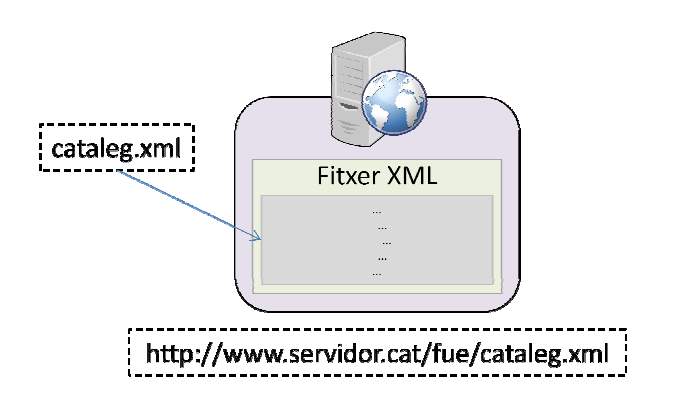
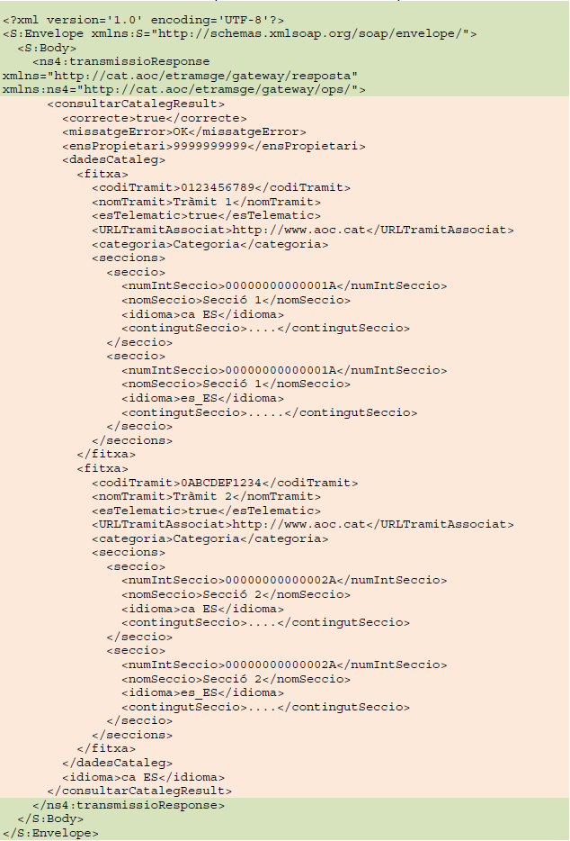
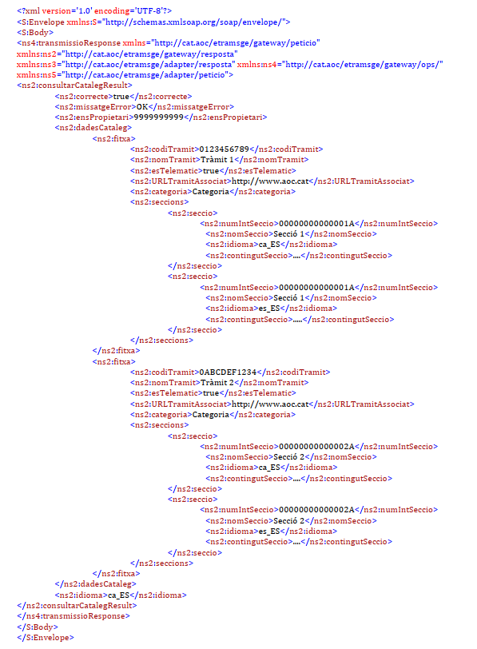

# Servei FUE Local
## Integració del catàleg de tràmits d’un ens amb solució pròpia cap a FUE (portal Canal Empresa)

FUE Local - Integració del catàleg de tràmits

# 1. Introducció

L’objectiu d’aquest document és descriure la implementació del mecanisme simplificat que permetrà distribuir el catàleg de tràmits d’un organisme cap a l’AOC i aquest cap a la Finestreta Única Empresarial (FUE) impulsada a Catalunya per la Oficina de Gestió Empresarial (OGE).

# 2. Implementació

La implementació que haureu de realitzar consisteix en la **publicació d’un fitxer XML estàtic a un servidor web** (Apache, IIS, etc...) que haurà de simular la resposta que s’obtindria des de un Web Service.

D’aquesta manera s’aconsegueix evitar tota tasca de programació i el manteniment 
únicament consistirà en modificar aquest fitxer estàtic per quan escaigui per mantenir les dades i informacions al dia. 

## 2.1 Format del fitxer

A continuació es mostra el format que ha de tenir el fitxer XML a publicar al servidor web.

La part d’XML en color verd correspon a la part del fitxer necessària que des de l’AOC utilitzem per a simular la resposta que donaria el nostre servei web intern, és una part fixa i no s’ha de modificar.

La part d’XML en color beige correspon a les dades del catàleg que cal personalitzar per cadascun dels tràmits i només està a mode d’exemple.

## 2.2 Relacions a incorporar a l’XML

A continuació es mostra l’equivalència i codificació dels diferents tràmits d’activitats per a què un ens amb solució de tramitació pròpia (que no sigui e-TRAM) pugui exposar el seu catàleg de tràmits a Canal Empresa, via el Consorci AOC.

### 2.2.1 Codificació dels tràmits potencials a incloure (node *fitxa XML*)

| **nomTramit** | **codiTramit** |
| --- | --- |
| Declaració responsable d&#39;obertura | 8b4480882a1a497ea49a3d75f678323a |
| Comunicació prèvia d&#39;obertura | acbb09265b434fa779d0bc41124d2e400 |
| Comunicació prèvia ambiental municipal (Annex III) | dd0bdc022d1448d6687dde442c374efa4 |
| Llicència ambiental | 8372cb9e38c648f99ed1ccf1b16cf0c9 |
| Consulta prèvia de classificació de l&#39;activitat | a1094dd3554f410aaa0bae5fc7b0e4211 |
| Sol·licitud informe urbanístic associat a la tramitació d&#39;activitats| 1e9eeea3f3d142fabb12f0b2e3c8dc439 |
| Sol·licitud informe previ en matèria d&#39;incendis  | 64b288428f6f46589947633dae04c3315 |
| --- | --- |
| Llicència per a espectaacles públics o activitats recreatives de caràcter extraordinari| 2c17d26b3f6549966b96b88c6129d082c |
| Comunicació prèvia d&#39;esstabliments no permanents desmuntables. | 125a702426264b300b7e6782ca8eed8f5 |
| Llicència municipal d&#39;establiments oberts al públic de règim especial  | 4af40d89b08e471cc83035ca390158da8 |
| Comunicació prèvia d&#39;esstabliments fixos oberts al públic d&#39;espectacles públiccs i activitats recreatives ordinàries | aee81c1164374d355a3d7eedee8aca74f |
| Llicència d&#39;establiments fixos oberts al públic d&#39;espectacles públics i activitats recreatives ordinàries | c349792547bf41d22a297073dfe8c05aa |
| Comunicació prèvia de modificació no substancia d&#39;una activitat amb efectes sobre les persones o el medi ambient | f9b54450001d45b118bd608cab4a7551e |
| Comunicació prèvia de moodificació no substancial d&#39;un  establiment i/o un espectacle o activitat recreativa | 672098d0ba4b41d0099d964c3eb486e40 |
| Comunicació de transmissiió de llicència o dels efectes d&#39;una comunicació prèvia | ea8b8e37542e45033a3cbcf02496cf656 |
| Comunicació prèvia per a espectacles públics o activitats recreatives de caràcter extraordinari.| d41e3fc656e046fc99a3beb8390ce2df2 |
| Declaració responsable en matèria de salut alimentària | fe19dd38e1bc4a6aaaffbd8d654560c6f |

### 2.2.2 Codificació de les seccions dels tràmits (node seccions XML )

| **nomSeccio** | **numIntSecccio** |
| --- | --- |
| Nom del tràmit | 3bc4204ddd414b29bb4350ada0854471 |
| Descripció | 5e09344b1cf64f7dadfcadbeef394b5e3 |
| Organisme competent / Reesponsable | d614d4b400c011e28ecd8b33e6188709b |
| Àrea que tramita | bef66d94f66541aaa9776d9307952853 |
| Classificació temàtica | 52e27c3b4d1946e6bdf3acbbd27453cde |
| Qui el pot demanar | 308e7a939a9b4c64a5f78f470b9d00bb |
| Canals de tramitació | ca07068df2504e97ac0f063ff7df455c7 |
| Període de l&#39;any en què ess pot demanar | 132b640120834580925665035590a2dd |
| Termini de la sol·licitud | 706f3e092522497184486855a1974f591 |
| Requisits previs | 456c15b8be8745a29086deb728561506 |
| Preu | cddf6a3371a6472281b33a005e0f584ef |
| Mitjans de pagament | 38a7df6244054c39aa049c99177f4d793 |
| Documentació a aportar | 8c8e9b4bc5a047509bf1c5ddade99a4fd |
| Impresos del tràmit | e9c41b04682b448d936ec9339222c9d9f |
| Normativa | d9577ab1cfa74465832a8022aade43a09 |
| Termini de resolució | c4172b500a474810b260f3cca736ed467 |
| Silenci administratiu | 39582558b476466bb83949698846f051 |
| Vies de reclamació | 68f0e84f063243f0bba247f6e1802a0d |
| Tràmits associats | 478f91f9140d47d490610f5118c55448e |
| Altra informació d&#39;interès | 461f7c55290c47fd9046e8744ff24015c |
| Normativa reguladora del silenci administratiu  | b02f2f76396c47dd9d5d20f00e6c15e36 |
| Codificació del tràmit | e443b3ea426e4ef9bbeba3663019846e7 |
| Darrera actualització | ac37806b741241f6b6faeddf2296465b |
| Paraules claus de cerca | 6a3712d100a44a509a7a2b8b4eb040d5 |
| Procediment vinculat | 0d1b8d20a01243ae91359281a7f9a1dd |
| Peticions més comunes | 76bb9503c9854bf197bd73f143bb840b |
| Observacions internes | cd2e4d04f2fd4225870fed8fc9884713 |
| Passos a seguir per tramitació | 96c36afbe01048efb7efaa133f3fb9ff2 |

L&#39;XML no requereix infoormar obligatòriament totes les seccions anteriors, però per coherència amb la informmació es requerirà, com a mínim, mantenir el mateix nom a la secció, i informar obligatòriament les que estan **en verd** a la taula anterior.

## 3. Definició dels camps per a preparar l&#39;XML

A continuació es mostra la descripció corresponent a cada camp del XML estàtic presentat pel vostre servei.

### fitxa

|Camp | Tipuus | Obligatori | Descripció |
| -- | -- | -- | -- |
| codiTramit | Text(32) | Si | Número intern del tràmit (IT) . Codi de 32 caràcters alfanumèrics.|
| nomTramit | Text(500) | Si | Nom concret del tràmit (IT) |
| esTelematic | Boolleà | Si | Indica si la fitxa permet trammitació telemática |
| URLTramitAssociat | Textt(8000) | Si | Link cap el tràmit associat a la fitxa (IT)|
| categoria | Text(100) | No | Àmbit de la IT (Atenció a la ciutadania, Padró Habitants, Via Pública, etc.)|
| seccions | TipusSeccio   | Si | Tipus complex amb la llistta de seccions de la fitxa i els seus continguts |

### seccions

|Camp | Tipuus | Obligatori | Descripció |
| -- | -- | -- | -- |
| numIntSeccio | Text(32) | Si | NNúmero inte rn de la secció (codi de 32 caràcters alfanumèrics).|
| nomSeccio | Text(256) | Si | Nom de la secció |
| idioma | idioma | Si | Idioma del contingut de la secció.  <vi>Català -> ca_ES <vi>Castellà -> es_ES  <vi> Aranès -> oc_ES   *	Complir amb aquests valors respectant majúscules i minúscules i subguió  |
| URLTramitAssociat | Textt(8000) | Si | Link cap el tràmit associat a la fitxa (IT)|
| contingutSeccio | Text(8000) | Si | Contingut de la secció|

## 4. Fitxer estàtic d&#39;exemple

